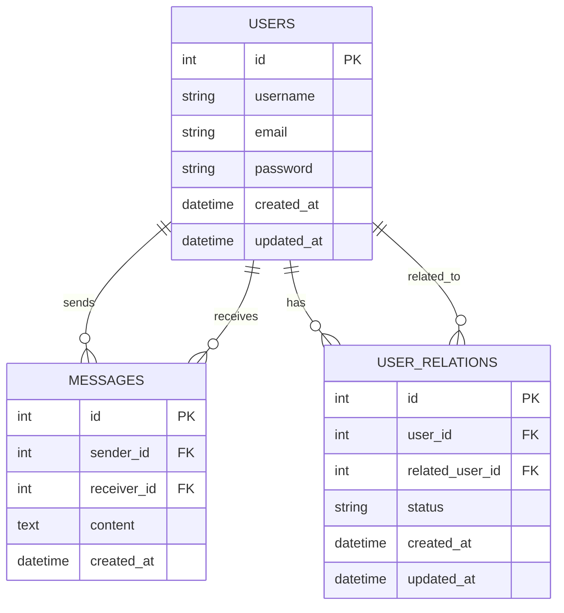

# 数据库设计

## 实体关系图

## 表结构说明

### users 表
存储用户基本信息

| 字段名 | 类型 | 约束 | 说明 |
|-------|------|------|------|
| id | INT | PRIMARY KEY, AUTO_INCREMENT | 用户唯一标识 |
| username | VARCHAR(50) | UNIQUE, NOT NULL | 用户名 |
| email | VARCHAR(100) | UNIQUE, NOT NULL | 邮箱 |
| password | VARCHAR(255) | NOT NULL | 密码（加密存储） |
| created_at | TIMESTAMP | DEFAULT CURRENT_TIMESTAMP | 创建时间 |
| updated_at | TIMESTAMP | DEFAULT CURRENT_TIMESTAMP ON UPDATE CURRENT_TIMESTAMP | 更新时间 |

### messages 表
存储用户间的消息

| 字段名 | 类型 | 约束 | 说明 |
|-------|------|------|------|
| id | INT | PRIMARY KEY, AUTO_INCREMENT | 消息唯一标识 |
| sender_id | INT | NOT NULL, FOREIGN KEY | 发送者ID |
| receiver_id | INT | NOT NULL, FOREIGN KEY | 接收者ID |
| content | TEXT | NOT NULL | 消息内容 |
| created_at | TIMESTAMP | DEFAULT CURRENT_TIMESTAMP | 创建时间 |

### user_relations 表
存储用户间的关系（好友关系）

| 字段名 | 类型 | 约束 | 说明 |
|-------|------|------|------|
| id | INT | PRIMARY KEY, AUTO_INCREMENT | 关系唯一标识 |
| user_id | INT | NOT NULL, FOREIGN KEY | 用户ID |
| related_user_id | INT | NOT NULL, FOREIGN KEY | 关联用户ID |
| status | ENUM('pending', 'accepted', 'blocked') | DEFAULT 'pending' | 关系状态 |
| created_at | TIMESTAMP | DEFAULT CURRENT_TIMESTAMP | 创建时间 |
| updated_at | TIMESTAMP | DEFAULT CURRENT_TIMESTAMP ON UPDATE CURRENT_TIMESTAMP | 更新时间 |